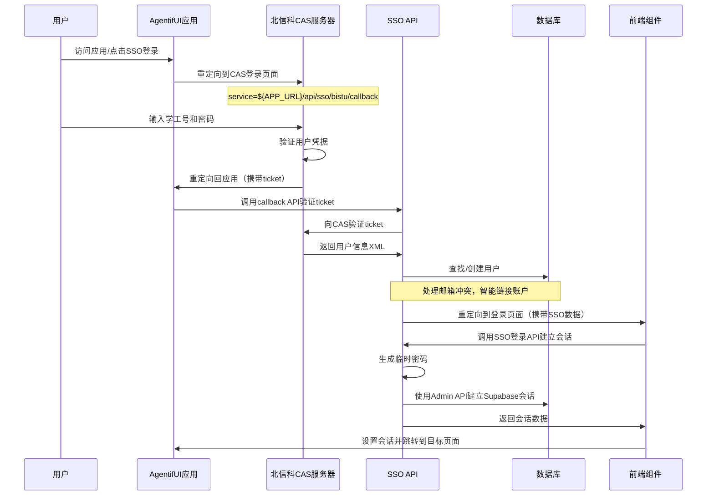
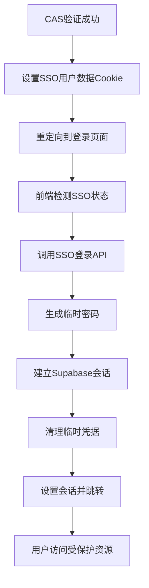

# 北京信息科技大学SSO集成技术方案

## 概述

本文档详细描述了将北京信息科技大学统一认证系统（CAS）集成到AgentifUI平台的技术方案。该方案基于CAS 2.0/3.0协议，实现用户通过学校SSO系统的单点登录功能。

**项目目标**：
- 实现北京信息科技大学CAS SSO登录集成
- 首次登录时自动创建用户账户
- 存储用户的学工号（employeeNumber）作为企业标识
- 后续登录时基于学工号识别用户身份
- 完全兼容现有的认证体系
- 支持邮箱冲突自动处理
- 实现安全的会话管理机制

**文档版本**：v2.0  
**更新日期**：2025-01-08

## 目录

1. [SSO认证流程分析](#sso认证流程分析)
2. [技术架构设计](#技术架构设计)
3. [数据库设计](#数据库设计)
4. [核心功能实现](#核心功能实现)
5. [API接口设计](#api接口设计)
6. [会话管理机制](#会话管理机制)
7. [安全考虑](#安全考虑)
8. [错误处理和故障排查](#错误处理和故障排查)
9. [部署配置](#部署配置)
10. [监控和维护](#监控和维护)

---

## SSO认证流程分析

### 北京信息科技大学CAS协议分析

北京信息科技大学采用标准的CAS（Central Authentication Service）协议，支持CAS 2.0和CAS 3.0版本。

#### 核心端点信息

| 端点类型 | URL | 协议版本 | 功能描述 |
|----------|-----|----------|----------|
| 登录入口 | `https://sso.bistu.edu.cn/login` | CAS 2.0/3.0 | 用户登录页面 |
| 注销入口 | `https://sso.bistu.edu.cn/logout` | CAS 2.0/3.0 | 用户注销 |
| 票据验证 | `https://sso.bistu.edu.cn/serviceValidate` | CAS 2.0 | 票据验证接口 |
| 票据验证 | `https://sso.bistu.edu.cn/p3/serviceValidate` | CAS 3.0 | 增强票据验证接口 |

#### 增强的认证流程

##### 完整登录流程



##### CAS响应数据格式

实际的CAS XML响应示例：

```xml
<cas:serviceResponse xmlns:cas='http://www.yale.edu/tp/cas'>
  <cas:authenticationSuccess>
    <cas:user>2021011221</cas:user>
    <cas:attributes>
      <cas:name>张三</cas:name>
      <cas:username>2021011221</cas:username>
    </cas:attributes>
  </cas:authenticationSuccess>
</cas:serviceResponse>
```

**关键字段说明**：
- `cas:user`: 用户登录名（学工号）
- `cas:name`: 真实姓名
- `cas:username`: 学工号（通常与cas:user相同）

---

## 技术架构设计

### 系统架构图

```
┌─────────────────────────────────────────────────────────────┐
│                        前端层                                │
├─────────────────────────────────────────────────────────────┤
│ React组件                                                    │
│ ├── BistuSSOButton (登录按钮)                               │
│ ├── LoginForm (自动会话处理)                                │
│ └── Middleware (认证状态检测)                               │
└─────────────────────────────────────────────────────────────┘
                                │
┌─────────────────────────────────────────────────────────────┐
│                       API层                                 │
├─────────────────────────────────────────────────────────────┤
│ Next.js API Routes                                          │
│ ├── /api/sso/bistu/login (SSO登录入口)                     │
│ ├── /api/sso/bistu/callback (CAS回调处理)                  │
│ ├── /api/sso/bistu/logout (SSO注销)                        │
│ └── /api/auth/sso-signin (会话建立API)                     │
└─────────────────────────────────────────────────────────────┘
                                │
┌─────────────────────────────────────────────────────────────┐
│                      服务层                                  │
├─────────────────────────────────────────────────────────────┤
│ 业务逻辑服务                                                │
│ ├── BistuCASService (CAS协议处理)                          │
│ ├── SSOUserService (用户管理)                              │
│ └── AdminClient (Supabase管理员客户端)                     │
└─────────────────────────────────────────────────────────────┘
                                │
┌─────────────────────────────────────────────────────────────┐
│                      数据层                                  │
├─────────────────────────────────────────────────────────────┤
│ Supabase数据库                                              │
│ ├── profiles (用户资料，含employee_number)                 │
│ ├── sso_providers (SSO提供商配置)                          │
│ ├── auth.users (Supabase认证用户)                          │
│ └── 数据库函数 (用户查找、创建、更新)                       │
└─────────────────────────────────────────────────────────────┘
                                │
┌─────────────────────────────────────────────────────────────┐
│                    外部服务                                  │
├─────────────────────────────────────────────────────────────┤
│ 北京信息科技大学CAS服务器                                   │
│ └── https://sso.bistu.edu.cn                               │
└─────────────────────────────────────────────────────────────┘
```

### 核心组件设计

#### 1. CAS服务组件

```typescript
interface BistuCASService {
  // 生成登录URL
  generateLoginURL(returnUrl?: string): string
  
  // 生成注销URL
  generateLogoutURL(returnUrl?: string): string
  
  // 验证ticket并获取用户信息
  validateTicket(ticket: string, service: string): Promise<BistuUserInfo>
  
  // 解析CAS XML响应
  parseValidationResponse(xmlText: string): BistuUserInfo
}

interface BistuUserInfo {
  employeeNumber: string  // 学工号（主要标识）
  username: string        // 用户名
  success: boolean        // 验证是否成功
  attributes?: {
    name?: string         // 真实姓名
    username?: string     // 学工号
    [key: string]: any    // 其他属性
  }
  rawResponse?: string    // 原始XML响应（调试用）
}
```

#### 2. 用户管理组件

```typescript
interface SSOUserService {
  // 通过学工号查找用户（实际通过邮箱查找）
  findUserByEmployeeNumber(employeeNumber: string): Promise<Profile | null>
  
  // 创建SSO用户（含邮箱冲突处理）
  createSSOUser(userData: CreateSSOUserData): Promise<Profile>
  
  // 更新用户最后登录时间
  updateLastLogin(userId: string): Promise<boolean>
  
  // 获取北信科SSO提供商信息
  getBistuSSOProvider(): Promise<{id: string, name: string} | null>
}

interface CreateSSOUserData {
  employeeNumber: string  // 学工号
  username: string        // 用户名
  fullName?: string       // 全名
  ssoProviderId: string   // SSO提供商ID
}
```

---

## 数据库设计

### 现有表结构扩展

#### 1. profiles表扩展

```sql
-- 添加学工号字段
ALTER TABLE profiles 
ADD COLUMN IF NOT EXISTS employee_number TEXT;

-- 添加唯一约束
ALTER TABLE profiles 
ADD CONSTRAINT profiles_employee_number_key 
UNIQUE (employee_number);

-- 添加索引优化查询
CREATE INDEX IF NOT EXISTS idx_profiles_employee_number 
ON profiles(employee_number) 
WHERE employee_number IS NOT NULL;

-- 字段注释
COMMENT ON COLUMN profiles.employee_number 
IS '学工号：北京信息科技大学统一身份标识';
```

#### 2. sso_providers表配置

```sql
-- 扩展SSO协议枚举以支持CAS
ALTER TYPE sso_protocol ADD VALUE IF NOT EXISTS 'CAS';

-- 插入北京信息科技大学SSO配置
INSERT INTO sso_providers (
  id,
  name,
  protocol,
  settings,
  enabled
) VALUES (
  '10000000-0000-0000-0000-000000000001',
  '北京信息科技大学',
  'CAS'::sso_protocol,
  jsonb_build_object(
    'base_url', 'https://sso.bistu.edu.cn',
    'login_endpoint', '/login',
    'logout_endpoint', '/logout',
    'validate_endpoint', '/serviceValidate',
    'validate_endpoint_v3', '/p3/serviceValidate',
    'version', '2.0',
    'attributes_enabled', true,
    'description', '北京信息科技大学统一认证系统',
    'support_attributes', jsonb_build_array('employeeNumber', 'name', 'username')
  ),
  true
) ON CONFLICT (id) DO UPDATE SET
  settings = EXCLUDED.settings,
  updated_at = NOW();
```

#### 3. 数据库函数

**学工号查找函数**：
```sql
CREATE OR REPLACE FUNCTION find_user_by_employee_number(emp_num TEXT)
RETURNS TABLE(
  user_id UUID,
  full_name TEXT,
  username TEXT,
  employee_number TEXT,
  last_login TIMESTAMP WITH TIME ZONE,
  auth_source TEXT,
  status account_status
) 
LANGUAGE plpgsql
SECURITY DEFINER
AS $$
BEGIN
  RETURN QUERY
  SELECT 
    p.id,
    p.full_name,
    p.username,
    p.employee_number,
    p.last_login,
    p.auth_source,
    p.status
  FROM profiles p
  WHERE p.employee_number = TRIM(emp_num)
    AND p.status = 'active'::account_status;
END;
$$;
```

**SSO用户创建函数**：
```sql
CREATE OR REPLACE FUNCTION create_sso_user(
  emp_number TEXT,
  user_name TEXT,
  sso_provider_uuid UUID
)
RETURNS UUID
LANGUAGE plpgsql
SECURITY DEFINER
AS $$
DECLARE
  new_user_id UUID;
  final_username TEXT;
  counter INTEGER := 0;
BEGIN
  -- 验证参数
  IF emp_number IS NULL OR LENGTH(TRIM(emp_number)) = 0 THEN
    RAISE EXCEPTION 'Employee number cannot be null or empty';
  END IF;
  
  -- 生成唯一用户名
  final_username := TRIM(user_name);
  WHILE EXISTS (SELECT 1 FROM profiles WHERE username = final_username) LOOP
    counter := counter + 1;
    final_username := TRIM(user_name) || '_' || counter;
  END LOOP;
  
  -- 创建用户记录
  new_user_id := gen_random_uuid();
  INSERT INTO profiles (
    id, employee_number, username, full_name,
    auth_source, sso_provider_id, status, role,
    created_at, updated_at, last_login
  ) VALUES (
    new_user_id, TRIM(emp_number), final_username, TRIM(user_name),
    'bistu_sso', sso_provider_uuid::TEXT, 'active'::account_status, 'user'::user_role,
    NOW(), NOW(), NOW()
  );
  
  RETURN new_user_id;
END;
$$;
```

---

## 核心功能实现

### 1. 增强的BISTU CAS服务

`lib/services/sso/bistu-cas-service.ts` 实现了完整的CAS客户端：

```typescript
export class BistuCASService {
  private config: BistuSSOConfig;
  private xmlParser: XMLParser;

  constructor(config: BistuSSOConfig) {
    this.config = config;
    // 禁用属性值自动类型转换，确保类型安全
    this.xmlParser = new XMLParser({
      ignoreAttributes: false,
      attributeNamePrefix: '@_',
      parseAttributeValue: false,
    });
  }

  /**
   * 生成CAS登录URL
   */
  generateLoginURL(returnUrl?: string): string {
    const serviceUrl = returnUrl ? 
      `${this.config.serviceUrl}?returnUrl=${encodeURIComponent(returnUrl)}` : 
      this.config.serviceUrl;

    const params = new URLSearchParams({ service: serviceUrl });
    return `${this.config.baseUrl}/login?${params.toString()}`;
  }

  /**
   * 验证ticket并获取用户信息
   */
  async validateTicket(ticket: string, service: string): Promise<BistuUserInfo> {
    try {
      const validateEndpoint = this.config.version === '3.0' 
        ? '/p3/serviceValidate' 
        : '/serviceValidate';

      const response = await fetch(
        `${this.config.baseUrl}${validateEndpoint}?${new URLSearchParams({ service, ticket })}`,
        {
          method: 'GET',
          headers: {
            'Accept': 'application/xml, text/xml',
            'User-Agent': 'AgentifUI-BISTU-SSO-Client/1.0',
          },
          signal: AbortSignal.timeout(10000), // 10秒超时
        }
      );

      const xmlText = await response.text();
      return this.parseValidationResponse(xmlText);
    } catch (error) {
      return {
        employeeNumber: '',
        username: '',
        success: false,
        attributes: { error: error.message },
      };
    }
  }

  /**
   * 解析CAS验证响应XML
   */
  private parseValidationResponse(xmlText: string): BistuUserInfo {
    try {
      const parsed = this.xmlParser.parse(xmlText);
      const serviceResponse = parsed['cas:serviceResponse'];

      if (serviceResponse['cas:authenticationSuccess']) {
        const success = serviceResponse['cas:authenticationSuccess'];
        const user = success['cas:user'];
        const attributes = success['cas:attributes'] || {};

        // 确保所有字段都转换为字符串类型
        const username = String(user || '');
        const employeeNumber = String(user || '');
        const realName = String(attributes['cas:name'] || '');

        return {
          username,
          employeeNumber,
          success: true,
          attributes: {
            name: realName,
            username: String(attributes['cas:username'] || ''),
            // 移除cas:前缀的其他属性
            ...Object.keys(attributes).reduce((acc, key) => {
              if (key.startsWith('cas:')) {
                const cleanKey = key.replace('cas:', '');
                acc[cleanKey] = String(attributes[key] || '');
              }
              return acc;
            }, {} as Record<string, any>),
          },
          rawResponse: xmlText,
        };
      } else if (serviceResponse['cas:authenticationFailure']) {
        const failure = serviceResponse['cas:authenticationFailure'];
        return {
          employeeNumber: '',
          username: '',
          success: false,
          attributes: {
            error_code: failure['@_code'] || 'UNKNOWN_ERROR',
            error_message: typeof failure === 'string' ? failure : failure['#text'] || 'Authentication failed',
          },
          rawResponse: xmlText,
        };
      }

      throw new Error('Unexpected CAS response format');
    } catch (error) {
      return {
        employeeNumber: '',
        username: '',
        success: false,
        attributes: { parse_error: error.message },
        rawResponse: xmlText,
      };
    }
  }
}
```

### 2. 完善的SSO用户管理服务

`lib/services/user/sso-user-service.ts` 实现了智能的用户管理：

```typescript
export class SSOUserService {
  /**
   * 通过学工号查找用户（实际通过邮箱查找）
   */
  static async findUserByEmployeeNumber(employeeNumber: string): Promise<Profile | null> {
    const supabase = await createClient();
    
    // 构建SSO用户的邮箱地址
    const email = `${employeeNumber.trim()}@bistu.edu.cn`;
    
    // 先使用普通客户端查找
    const { data, error } = await supabase
      .from('profiles')
      .select('*')
      .eq('email', email)
      .single();

    if (error) {
      if (error.code === 'PGRST116') {
        // 使用Admin客户端重试（绕过RLS）
        const adminSupabase = await createAdminClient();
        const { data: adminData, error: adminError } = await adminSupabase
          .from('profiles')
          .select('*')
          .eq('email', email)
          .single();

        if (adminError?.code === 'PGRST116') {
          return null; // 用户不存在
        }
        return adminData as Profile;
      }
      throw error;
    }

    return data as Profile;
  }

  /**
   * 创建SSO用户（含邮箱冲突处理）
   */
  static async createSSOUser(userData: CreateSSOUserData): Promise<Profile> {
    const adminSupabase = await createAdminClient();
    const email = `${userData.employeeNumber}@bistu.edu.cn`;

    // 检查用户是否已存在
    const existingUser = await this.findUserByEmployeeNumber(userData.employeeNumber);
    if (existingUser) {
      return existingUser;
    }

    // 使用Admin API创建auth.users记录
    const { data: authUser, error: authError } = await adminSupabase.auth.admin.createUser({
      email,
      user_metadata: {
        full_name: userData.fullName || userData.username,
        username: userData.username,
        employee_number: userData.employeeNumber,
        auth_source: 'bistu_sso',
        sso_provider_id: userData.ssoProviderId,
      },
      email_confirm: true, // SSO用户自动确认邮箱
    });

    // 处理邮箱冲突问题
    if (authError && authError.message.includes('already been registered')) {
      // 重新查找现有用户，使用多种策略
      const existingUser = await this.findUserByEmployeeNumber(userData.employeeNumber);
      if (existingUser) {
        return existingUser;
      }

      // 查找auth.users记录并创建对应的profile
      const { data: authUsers } = await adminSupabase.auth.admin.listUsers();
      const authUser = authUsers?.users?.find(user => user.email === email);
      
      if (authUser) {
        // 创建缺失的profile记录
        const { data: newProfile, error: createError } = await adminSupabase
          .from('profiles')
          .insert({
            id: authUser.id,
            employee_number: userData.employeeNumber,
            username: userData.username,
            full_name: userData.fullName || userData.username,
            auth_source: 'bistu_sso',
            sso_provider_id: userData.ssoProviderId,
            email: email,
            status: 'active',
            role: 'user',
          })
          .select()
          .single();

        if (createError) {
          throw new Error('PROFILE_CREATION_FAILED');
        }
        return newProfile as Profile;
      }

      throw new Error('ACCOUNT_DATA_INCONSISTENT');
    }

    if (authError) {
      throw authError;
    }

    // 等待触发器创建profile，然后查找并更新
    let profile = null;
    for (let retry = 0; retry < 3; retry++) {
      await new Promise(resolve => setTimeout(resolve, 500));
      profile = await this.findUserByEmployeeNumber(userData.employeeNumber);
      if (profile) break;
    }

    // 如果触发器创建失败，手动创建profile
    if (!profile) {
      const { data: newProfile, error: createError } = await adminSupabase
        .from('profiles')
        .insert({
          id: authUser.user.id,
          employee_number: userData.employeeNumber,
          username: userData.username,
          full_name: userData.fullName || userData.username,
          auth_source: 'bistu_sso',
          sso_provider_id: userData.ssoProviderId,
          email: email,
          status: 'active',
          role: 'user',
        })
        .select()
        .single();

      if (createError) {
        throw createError;
      }
      profile = newProfile;
    }

    return profile;
  }
}
```

---

## API接口设计

### 1. SSO登录入口API

`app/api/sso/bistu/login/route.ts` - 处理SSO登录请求：

```typescript
export async function GET(request: NextRequest) {
  const searchParams = request.nextUrl.searchParams;
  const returnUrl = searchParams.get('returnUrl') || '/chat';
  
  // 安全验证重定向URL
  const allowedReturnUrls = ['/chat', '/dashboard', '/settings', '/apps', '/'];
  const isValidReturnUrl = returnUrl.startsWith('/') && 
    (allowedReturnUrls.includes(returnUrl) || returnUrl.startsWith('/chat/'));
  const safeReturnUrl = isValidReturnUrl ? returnUrl : '/chat';
  
  // 创建CAS服务并生成登录URL
  const casService = createBistuCASService();
  const loginUrl = casService.generateLoginURL(safeReturnUrl);
  
  return NextResponse.redirect(loginUrl);
}
```

### 2. SSO回调处理API

`app/api/sso/bistu/callback/route.ts` - 处理CAS回调：

```typescript
export async function GET(request: NextRequest) {
  const requestUrl = new URL(request.url);
  const ticket = requestUrl.searchParams.get('ticket');
  const returnUrl = requestUrl.searchParams.get('returnUrl') || '/chat';
  
  if (!ticket) {
    return NextResponse.redirect(
      new URL('/login?error=missing_ticket&message=认证参数缺失', appUrl)
    );
  }

  try {
    // 验证ticket
    const casService = createBistuCASService();
    const userInfo = await casService.validateTicket(ticket, serviceUrl);
    
    if (!userInfo.success || !userInfo.employeeNumber) {
      return NextResponse.redirect(
        new URL('/login?error=ticket_validation_failed', appUrl)
      );
    }

    // 查找或创建用户
    let user = await SSOUserService.findUserByEmployeeNumber(userInfo.employeeNumber);
    
    if (!user) {
      // 创建新用户
      const ssoProvider = { id: '10000000-0000-0000-0000-000000000001' };
      user = await SSOUserService.createSSOUser({
        employeeNumber: userInfo.employeeNumber,
        username: userInfo.username,
        fullName: userInfo.attributes?.name || userInfo.username,
        ssoProviderId: ssoProvider.id,
      });
    } else {
      // 更新最后登录时间
      await SSOUserService.updateLastLogin(user.id);
    }

    // 设置SSO用户数据cookie并重定向到登录页面
    const userEmail = `${user.employee_number}@bistu.edu.cn`;
    const successUrl = new URL('/login', appUrl);
    successUrl.searchParams.set('sso_login', 'success');
    successUrl.searchParams.set('user_id', user.id);
    successUrl.searchParams.set('user_email', userEmail);
    successUrl.searchParams.set('redirect_to', returnUrl);
    
    const response = NextResponse.redirect(successUrl);
    
    // 设置SSO用户数据cookie
    const ssoUserData = {
      userId: user.id,
      email: userEmail,
      employeeNumber: user.employee_number,
      username: user.username,
      fullName: user.full_name,
      authSource: 'bistu_sso',
      loginTime: Date.now(),
      expiresAt: Date.now() + (24 * 60 * 60 * 1000), // 24小时过期
    };

    response.cookies.set('sso_user_data', JSON.stringify(ssoUserData), {
      httpOnly: false, // 允许前端读取
      secure: process.env.NODE_ENV === 'production',
      sameSite: 'lax',
      maxAge: 24 * 60 * 60,
      path: '/',
    });

    return response;
  } catch (error) {
    return NextResponse.redirect(
      new URL('/login?error=sso_callback_failed', appUrl)
    );
  }
}
```

### 3. SSO注销API

`app/api/sso/bistu/logout/route.ts` - 处理注销：

```typescript
export async function GET(request: NextRequest) {
  const casService = createBistuCASService();
  const logoutUrl = casService.generateLogoutURL();
  
  const response = NextResponse.redirect(logoutUrl);
  
  // 清除会话cookie
  const cookiesToClear = ['sso_session', 'sb-access-token', 'sb-refresh-token'];
  cookiesToClear.forEach(cookieName => {
    response.cookies.set(cookieName, '', { maxAge: 0, path: '/' });
  });

  return response;
}
```

### 4. SSO会话建立API

`app/api/auth/sso-signin/route.ts` - 建立Supabase会话：

```typescript
export async function POST(request: NextRequest) {
  const { userId, userEmail, ssoUserData } = await request.json();
  
  // 验证SSO数据时效性
  if (Date.now() > ssoUserData.expiresAt) {
    return NextResponse.json({ message: 'SSO会话已过期' }, { status: 401 });
  }

  const adminSupabase = await createAdminClient();
  
  // 验证用户存在
  const { data: user, error: userError } = await adminSupabase.auth.admin.getUserById(userId);
  if (userError || !user) {
    return NextResponse.json({ message: '用户不存在' }, { status: 404 });
  }

  // 使用临时密码方法建立会话
  const tempPassword = `SSO_${Date.now()}_${Math.random().toString(36).substring(2, 15)}`;
  
  // 设置临时密码
  await adminSupabase.auth.admin.updateUserById(userId, { password: tempPassword });
  
  // 使用临时密码登录
  const { data: signInData, error: signInError } = await adminSupabase.auth.signInWithPassword({
    email: user.user.email,
    password: tempPassword,
  });

  // 立即清理临时密码
  await adminSupabase.auth.admin.updateUserById(userId, { password: undefined });

  if (signInError || !signInData.session) {
    return NextResponse.json({ message: '会话创建失败' }, { status: 500 });
  }

  return NextResponse.json({
    success: true,
    session: signInData.session,
    message: 'SSO登录成功',
  });
}
```

---

## 会话管理机制

### 1. SSO会话生命周期



### 2. Cookie数据结构

```typescript
interface SSOUserData {
  userId: string;           // Supabase用户ID
  email: string;            // 用户邮箱（学工号@bistu.edu.cn）
  employeeNumber: string;   // 学工号
  username: string;         // 用户名
  fullName: string;         // 真实姓名
  authSource: 'bistu_sso'; // 认证来源
  loginTime: number;        // 登录时间戳
  expiresAt: number;        // 过期时间戳（24小时）
}
```

### 3. 中间件集成

`middleware.ts` 检测SSO状态：

```typescript
export async function middleware(request: NextRequest) {
  const url = new URL(request.url);
  const pathname = url.pathname;

  // 检测SSO登录成功状态
  const ssoLoginSuccess = url.searchParams.get('sso_login') === 'success';
  const hasSsoUserCookie = request.cookies.get('sso_user_data');

  // SSO处理期间暂时跳过认证检查
  if (ssoLoginSuccess || hasSsoUserCookie) {
    console.log(`[Middleware] SSO session detected, allowing request to ${pathname}`);
    return response;
  }

  // 正常认证流程...
}
```

### 4. 前端自动处理

`components/auth/login-form.tsx` 自动处理SSO会话：

```typescript
useEffect(() => {
  const handleSSOSession = async () => {
    const ssoLoginSuccess = searchParams.get('sso_login') === 'success';
    const userId = searchParams.get('user_id');
    const userEmail = searchParams.get('user_email');
    
    if (ssoLoginSuccess && userId && userEmail) {
      setSsoProcessing(true);
      
      try {
        // 读取SSO用户数据cookie
        const ssoUserCookie = document.cookie
          .split('; ')
          .find(row => row.startsWith('sso_user_data='));
        
        const ssoUserData = JSON.parse(decodeURIComponent(ssoUserCookie.split('=')[1]));
        
        // 调用SSO登录API
        const response = await fetch('/api/auth/sso-signin', {
          method: 'POST',
          headers: { 'Content-Type': 'application/json' },
          body: JSON.stringify({ userId, userEmail, ssoUserData }),
        });

        if (response.ok) {
          const { session } = await response.json();
          await supabase.auth.setSession(session);
          
          // 清理cookie并跳转
          document.cookie = 'sso_user_data=; expires=Thu, 01 Jan 1970 00:00:00 UTC; path=/;';
          router.replace(redirectTo);
        }
      } catch (error) {
        console.error('SSO会话处理失败:', error);
        setError(`SSO登录失败: ${error.message}`);
      } finally {
        setSsoProcessing(false);
      }
    }
  };

  handleSSOSession();
}, [searchParams, router]);
```

---

## 安全考虑

### 1. 认证安全

- **HTTPS要求**：生产环境强制使用HTTPS
- **Ticket验证**：每个ticket只能使用一次
- **Service URL一致性**：验证时的service URL必须与登录时一致
- **超时处理**：CAS请求设置10秒超时

### 2. 会话安全

- **临时密码机制**：使用随机生成的临时密码建立会话
- **立即清理**：临时密码使用后立即清除
- **Cookie安全**：生产环境使用secure cookie
- **时效控制**：SSO数据cookie 24小时自动过期

### 3. 数据安全

- **Service Role保护**：Service Role密钥仅在服务器端使用
- **参数验证**：所有输入参数进行严格验证
- **SQL注入防护**：使用参数化查询和数据库函数
- **RLS策略**：数据库行级安全策略保护

### 4. 重定向安全

- **URL白名单**：只允许预定义的内部路径
- **相对路径检查**：拒绝绝对URL重定向
- **防开放重定向**：多层验证重定向目标

---

## 错误处理和故障排查

### 1. 常见错误类型

#### 环境配置错误

```typescript
// 检查必需的环境变量
if (!process.env.NEXT_PUBLIC_APP_URL) {
  throw new Error('NEXT_PUBLIC_APP_URL environment variable is required');
}

if (!process.env.SUPABASE_SERVICE_ROLE_KEY) {
  throw new Error('SUPABASE_SERVICE_ROLE_KEY is required for SSO user creation');
}
```

#### CAS通信错误

```typescript
// Ticket验证失败处理
if (!userInfo.success) {
  console.error('CAS ticket validation failed:', {
    ticket: ticket.substring(0, 10) + '...',
    service: serviceUrl,
    response: userInfo.rawResponse,
  });
  
  return NextResponse.redirect(
    new URL('/login?error=cas_validation_failed&message=身份验证失败', appUrl)
  );
}
```

#### 用户创建错误

```typescript
// 邮箱冲突处理
if (authError && authError.message.includes('already been registered')) {
  console.log(`Email conflict detected for ${email}, attempting account linking`);
  
  const existingUser = await this.findUserByEmployeeNumber(userData.employeeNumber);
  if (existingUser) {
    console.log(`Successfully linked existing user: ${existingUser.id}`);
    return existingUser;
  }
  
  throw new Error('ACCOUNT_DATA_INCONSISTENT');
}
```

### 2. 调试工具

#### 详细日志记录

```typescript
// CAS响应调试
console.log('=== CAS原始XML响应 ===');
console.log(userInfo.rawResponse || '无响应数据');
console.log('=== 响应结束 ===');

// 用户创建调试
console.log(`Creating SSO user: ${userData.username} (${userData.employeeNumber})`);
console.log(`User email: ${email}, SSO Provider: ${userData.ssoProviderId}`);
```

#### 数据库状态检查

```sql
-- 检查SSO用户状态
SELECT 
  p.id,
  p.username,
  p.full_name,
  p.employee_number,
  p.auth_source,
  p.status,
  p.last_login,
  au.email,
  au.email_confirmed_at
FROM profiles p
LEFT JOIN auth.users au ON p.id = au.id
WHERE p.auth_source = 'bistu_sso'
ORDER BY p.created_at DESC;

-- 检查SSO提供商配置
SELECT id, name, protocol, enabled, settings
FROM sso_providers 
WHERE name = '北京信息科技大学';
```

### 3. 故障恢复

#### 数据不一致修复

```sql
-- 修复缺失的employee_number字段
UPDATE profiles 
SET employee_number = SPLIT_PART(email, '@', 1)
WHERE auth_source = 'bistu_sso' 
  AND employee_number IS NULL 
  AND email LIKE '%@bistu.edu.cn';

-- 修复auth_source字段
UPDATE profiles 
SET auth_source = 'bistu_sso'
WHERE email LIKE '%@bistu.edu.cn' 
  AND auth_source IS NULL;
```

#### 会话重建

```typescript
// 如果SSO会话建立失败，用户可以重新登录
const handleRetrySSO = async () => {
  // 清理现有cookie
  document.cookie = 'sso_user_data=; expires=Thu, 01 Jan 1970 00:00:00 UTC; path=/;';
  
  // 重新发起SSO登录
  window.location.href = '/api/sso/bistu/login?returnUrl=/chat';
};
```

---

## 部署配置

### 1. 环境变量配置

```bash
# 生产环境配置示例
NEXT_PUBLIC_APP_URL=https://your-domain.com
SUPABASE_SERVICE_ROLE_KEY=your-service-role-key
BISTU_SSO_BASE_URL=https://sso.bistu.edu.cn
BISTU_CAS_VERSION=2.0
NEXT_PUBLIC_SSO_ONLY_MODE=false
```

### 2. 数据库部署

```bash
# 应用SSO相关迁移
supabase db push

# 验证迁移状态
supabase migration list
```

### 3. 安全配置

- **HTTPS证书**：确保SSL证书有效且自动续期
- **域名解析**：配置正确的DNS记录
- **防火墙**：开放必要的端口（80, 443）
- **监控告警**：设置服务可用性监控

### 4. 性能优化

```sql
-- 添加数据库索引
CREATE INDEX CONCURRENTLY IF NOT EXISTS idx_profiles_bistu_active 
ON profiles(employee_number, auth_source) 
WHERE auth_source = 'bistu_sso' AND status = 'active';

CREATE INDEX CONCURRENTLY IF NOT EXISTS idx_profiles_email_bistu 
ON profiles(email) 
WHERE email LIKE '%@bistu.edu.cn';
```

---

## 监控和维护

### 1. 关键指标监控

- **SSO登录成功率**：监控ticket验证成功比例
- **用户创建成功率**：监控新用户创建成功比例  
- **会话建立成功率**：监控SSO会话建立成功比例
- **响应时间**：监控CAS请求和回调处理时间

### 2. 日志分析

```bash
# 分析SSO登录模式
grep "SSO login" /var/log/app.log | grep "$(date +%Y-%m-%d)" | wc -l

# 分析错误模式
grep "SSO.*failed" /var/log/app.log | tail -20

# 分析用户创建情况
grep "Successfully created new SSO user" /var/log/app.log | tail -10
```

### 3. 定期维护

- **清理过期数据**：定期清理过期的会话数据
- **更新配置**：根据需要更新CAS服务器配置
- **性能调优**：定期检查和优化数据库查询
- **安全审计**：定期审计SSO用户权限和访问记录

### 4. 备份策略

- **数据库备份**：每日自动备份用户数据
- **配置备份**：备份SSO相关配置和环境变量
- **迁移文件**：版本控制所有数据库迁移文件
- **恢复测试**：定期测试备份恢复流程

---

## 总结

本技术方案实现了完整的北京信息科技大学CAS SSO集成，包括：

1. **完整的CAS协议支持**：支持CAS 2.0/3.0，完善的XML解析和错误处理
2. **智能用户管理**：自动用户创建、邮箱冲突处理、数据一致性保证
3. **安全的会话管理**：临时密码机制、安全cookie、自动清理
4. **完善的错误处理**：详细日志、故障恢复、用户友好提示
5. **生产就绪**：HTTPS支持、性能优化、监控告警、备份策略

该方案确保了系统的安全性、可靠性和可维护性，为北信科用户提供了无缝的单点登录体验。 