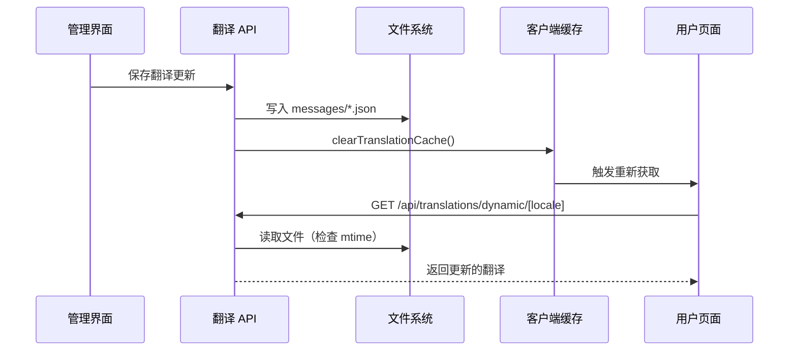

# 动态翻译系统架构

## 概述

本文档说明 AgentifUI 如何实现动态翻译系统，在更新翻译时无需重新构建应用程序，同时保持与 Next.js 静态编译的一致性且无需数据库。

## 问题描述

### 原始挑战

- **服务中断**：更新翻译需要重新构建整个 Next.js 应用程序，导致所有用户面临 1-2 分钟的停机时间
- **静态与动态冲突**：Next.js i18n 系统在构建时编译翻译，使得运行时更新变得不可能
- **数据库复杂性**：使用数据库存储翻译会引入复杂性，并可能与基于文件的数据源产生不一致

### 解决方案需求

- 零停机时间的翻译更新
- 维持基于文件的翻译源
- 保留 Next.js 静态优化的优势
- 无需额外的数据库依赖
- 特定页面（关于/主页）的实时更新

## 架构设计

### 双轨翻译系统

该解决方案实现了**双轨方法**，同时维护静态和动态翻译能力：

```
┌─────────────────┐    ┌─────────────────┐
│    静态路径     │    │    动态路径     │
│   (next-intl)   │    │  (自定义 API)   │
└─────────────────┘    └─────────────────┘
         │                       │
         ▼                       ▼
┌─────────────────┐    ┌─────────────────┐
│   构建时编译    │    │  运行时文件读取 │
└─────────────────┘    └─────────────────┘
         │                       │
         ▼                       ▼
┌─────────────────┐    ┌─────────────────┐
│   所有页面      │    │ 仅关于/主页     │
│   (兜底方案)    │    │  (实时更新)     │
└─────────────────┘    └─────────────────┘
```

### 核心组件

#### 1. 动态翻译 API (`app/api/translations/dynamic/[locale]/route.ts`)

```typescript
export async function GET(
  request: NextRequest,
  { params }: { params: Promise<{ locale: string }> }
) {
  const { locale } = await params;

  // 基于修改时间的智能文件缓存
  const filePath = path.join(process.cwd(), 'messages', `${locale}.json`);
  const stats = await fs.stat(filePath);
  const cacheKey = `${locale}_${stats.mtimeMs}`;

  // 仅返回特定页面部分以最小化负载
  return NextResponse.json({
    'pages.about': translations.pages?.about || {},
    'pages.home': translations.pages?.home || {},
  });
}
```

**关键特性：**

- **基于文件的缓存**：使用 `mtime`（修改时间）检测变更
- **选择性加载**：仅加载关于/主页翻译以最小化负载
- **零重建需求**：运行时直接从文件系统读取文件

#### 2. 动态翻译 Hook (`lib/hooks/use-dynamic-translations.ts`)

```typescript
export function useDynamicTranslations(config: UseDynamicTranslationsConfig) {
  // 三层缓存策略
  const [memoryCache, setMemoryCache] = useState<Record<string, any>>({});

  const t = useCallback(
    (key: string, section: string) => {
      // 第一层：内存缓存（最快）
      const dynamicValue = getNestedValue(dynamicData, `${section}.${key}`);

      // 第二层：HTTP 缓存（浏览器自动缓存）
      // 第三层：静态兜底（next-intl 编译翻译）
      return dynamicValue || staticT(`${section}.${key}`);
    },
    [dynamicData, staticT]
  );
}
```

#### 3. 页面集成

每个页面实现**优雅降级模式**：

```typescript
// 带有动态/静态兜底的增强翻译函数
const t = (key: string, params?: any) => {
  const dynamicValue = dynamicT(key, 'pages.about');
  return dynamicValue || staticT(key, params);
};
```

## 三层缓存机制

### 第一层：内存缓存（客户端）

- **用途**：对已加载翻译的即时访问
- **生命周期**：组件生命周期
- **失效**：通过 `clearTranslationCache()` 手动失效

### 第二层：HTTP 缓存（浏览器）

- **用途**：减少对未更改文件的网络请求
- **生命周期**：基于文件修改时间
- **失效**：文件 `mtime` 更改时自动失效

### 第三层：静态兜底（构建时）

- **用途**：确保加载或故障期间的功能性
- **生命周期**：应用部署周期
- **失效**：应用重新构建

## 数据流

### 翻译更新过程



### 实时更新流程

1. **管理员保存翻译** → 文件写入 `messages/*.json`
2. **缓存失效** → 调用 `clearTranslationCache()`
3. **用户页面检测变更** → React hooks 触发重新获取
4. **API 提供新数据** → 使用新 `mtime` 缓存键读取文件
5. **即时 UI 更新** → 无需重建，无停机时间

## 技术优势

### 性能优化

1. **选择性加载**：仅加载关于/主页翻译，而非整个语言文件
2. **智能缓存**：三层缓存策略最小化冗余请求
3. **基于修改时间的缓存**：文件更改时自动缓存失效
4. **优雅降级**：静态兜底确保网络问题期间的功能性

### 生产兼容性

1. **文件系统访问**：在具有文件系统访问权限的生产环境中工作
2. **无需数据库**：维持基于文件的翻译工作流
3. **保留构建优化**：静态页面仍受益于 Next.js 优化
4. **部署无关**：适用于各种托管策略

### 开发体验

1. **零配置**：自动检测支持的语言环境
2. **实时预览**：管理员可立即看到更改
3. **一致的 API**：与静态系统相同的翻译键结构
4. **类型安全**：维持完整的 TypeScript 支持

## 实施时间线

### 第一阶段：动态系统（提交 cd35188）

- 创建动态翻译 API 端点
- 实现带有三层缓存的 React hook
- 集成到关于和主页页面
- 添加缓存清除机制

### 第二阶段：UI 优化（提交 897f606）

- 从管理界面移除重建按钮
- 增强语言选择器，支持自动选择
- 统一页面间的加载状态
- 修复标签页标签中的语义问题

## 安全考虑

### 文件访问安全

- API 仅提供指定 `messages/` 目录中的翻译文件
- 无任意文件读取功能
- 语言环境参数验证以防止路径遍历

### 性能安全

- 通过 React 内置请求去重实现的固有速率限制
- 内存缓存大小自然受页面特定数据限制
- 通过翻译端点无敏感数据暴露

## 未来增强

### 潜在扩展

1. **其他页面**：根据需要将动态翻译扩展到其他页面
2. **翻译验证**：为翻译结构添加模式验证
3. **审计跟踪**：记录翻译更改以供管理监督
4. **性能监控**：跟踪缓存命中率和加载时间

### 可扩展性考虑

1. **CDN 集成**：动态 API 可在 CDN 级别缓存以实现全球性能
2. **懒加载**：通过仅加载可见部分翻译进一步优化
3. **WebSocket 更新**：翻译更改的实时推送通知

## 结论

这个动态翻译系统成功解决了重建停机时间问题，同时保持了 Next.js 静态优化的优势。双轨方法通过静态兜底确保可靠性，同时为关键的面向用户页面启用实时更新。

三层缓存机制提供最佳性能，基于文件的方法在不引入数据库依赖的情况下保持操作简单性。这种架构为 Next.js 应用程序中类似的静态到动态转换提供了模型。
